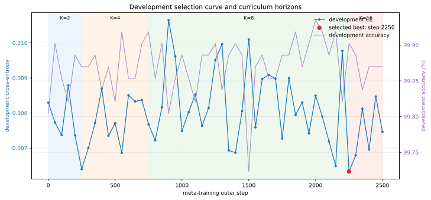
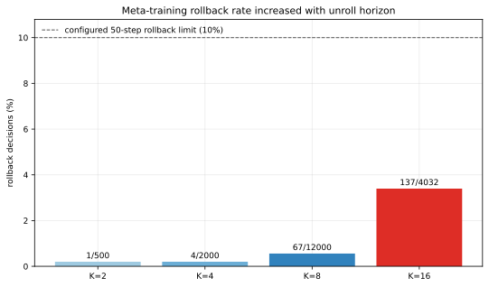
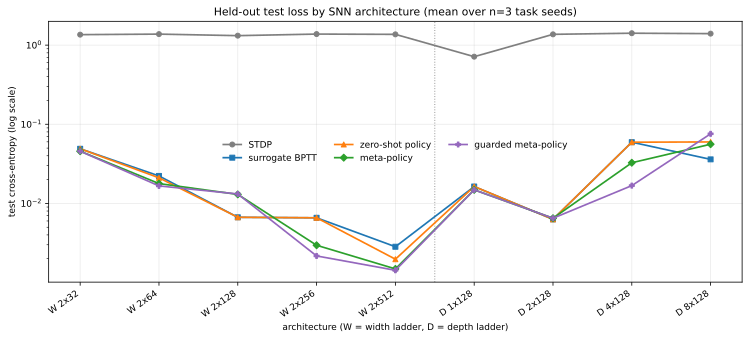
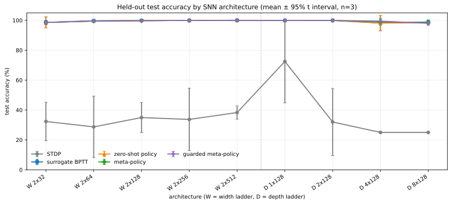
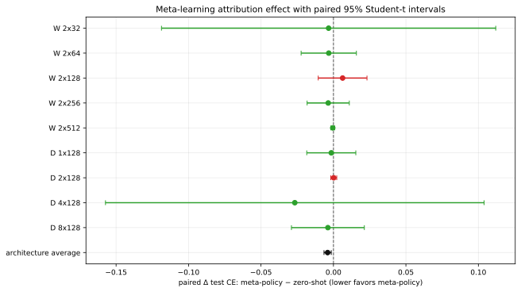
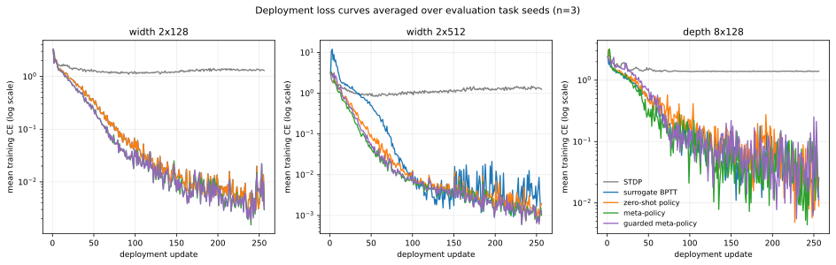
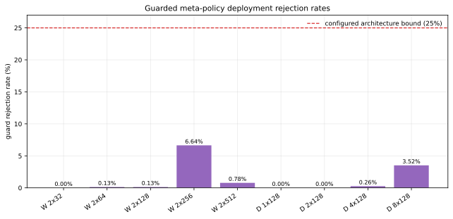
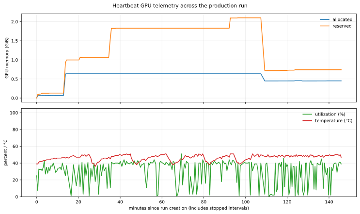

# Production SNN meta-optimizer report — July 12, 2026

This report documents run `15494a89-348e-450f-b538-ec6c5bdfdb8c`, performed
on July 12, 2026 in America/Los_Angeles. The run crossed midnight in UTC:
2026-07-12 22:04:02.389Z through 2026-07-13 00:30:20.860Z, corresponding to
15:04:02–17:30:20 PDT on July 12.

The experiment meta-trained a 50,868,617-parameter AlphaZero-style neural
optimizer, selected a frozen checkpoint using development tasks, and compared
it with untrained SNNs, pair-STDP, projected surrogate-BPTT, and its own
zero-shot initialization over progressively wider and deeper SNNs.

## Reproducibility status

> **The protocol and numerical experiment can be rerun from the current source
> with the reconstructed command below, but the archived July 12 run cannot be
> reproduced byte-for-byte.** Its exact production orchestration source and
> pre-run production-verification manifest were not archived, the actual argv
> and an environment lock were not logged, and its health-bound transition used
> a logged manual recovery. The unchanged scientific core source, full config,
> RNG seeds and checkpointed states, zero-shot/best/frozen policies, raw results,
> checksummed checkpoints, and append-only event log are retained.

This distinction matters:

- The archived run records composite production source digest
  `6aee3616106a98581879d07d683189ef1fb2c0df1ccf3c54619a99de2569c6cb`.
- The current hardened runner and the corrected analysis use composite digest
  `b4e4b4ba3f71dc748ea75cb56f99e0c8535eff79bd9083e84f83cf49376ca0f7`.
- The composite digest hashes each filename followed by its bytes for
  `snn_production.py`, `snn_meta_optimizer.py`, and
  `snn_production_support.py`.
- The scientific core file is unchanged and still has SHA-256
  `9e369e806d05b16c660527e8a9b9c2e6e070c092760c7eaf08d3ae976b0b4444`.
- The production-support file is unchanged and has SHA-256
  `ef0f45664786689cee633d1ebcfb44b1ec5ff715d8013f0577b89a7a23006d04`.
- The production runner was untracked at Git HEAD
  `d324395db6daed5267de5b98533a48aabc473e25`, so the historical production
  file cannot be recovered with `git checkout`.
- Production mode did not enable deterministic CUDA algorithms. Matching
  seeds, hardware, and software therefore does not guarantee bit-identical
  floating-point outputs even if the historical source were available.

The current runner includes automatic, crash-safe health-bound finalization,
per-run verification-manifest archival, terminal-error resume blocking, paired
Student-t summaries, and explicit termination/alarm fields. These changes
improve future reproducibility but necessarily change the output schema and
artifact hashes relative to this historical run.

## Executive result

- The policy contained **50,868,617 total parameters**, of which **50,851,656**
  could affect an optimizer action.
- The target was 3,000 outer meta steps. Training safely stopped at step 2,502
  after the K=16 horizon produced rollback-bearing outer steps three times in a
  row.
- The selected policy was the development-best checkpoint at step 2,250, with
  mean development cross-entropy `0.0063352505676448345` and accuracy
  `99.90234375%`.
- Across the nine tested architecture entries, the post-hoc paired
  meta-minus-zero-shot test CE was `-0.00402028`, with two-sided Student-t 95%
  CI `[-0.00653256, -0.00150801]`. This is suggestive within this one trained
  policy, not evidence across independently trained policies.
- Meta-policy versus tuned surrogate-BPTT was effectively tied overall:
  paired test CE `-0.00160501`, CI `[-0.01263927, +0.00942926]`.
- Meta-policy strongly outperformed this pair-STDP baseline: paired
  architecture-average test CE `-1.278697`, CI
  `[-1.298460, -1.258934]`, and accuracy `+63.607` percentage points, CI
  `[+58.197, +69.016]`.
- No configured deployment architecture bound or CUDA OOM was reached through
  width `2x512` (273,412 SNN parameters) and depth `8x128` (118,276 SNN
  parameters). These are demonstrated lower bounds only.
- A meta-training **horizon health bound was reached** at K=16. It must not be
  conflated with the deployment architecture bound.

## Run identity and lifecycle

| Field | Value |
|---|---|
| Run ID | `15494a89-348e-450f-b538-ec6c5bdfdb8c` |
| Local interval | 2026-07-12 15:04:02–17:30:20 PDT |
| UTC interval | 2026-07-12 22:04:02.389Z–2026-07-13 00:30:20.860Z |
| Wall span | 8,778.471 s = 2:26:18.471 |
| Planned meta steps | 3,000 |
| Completed meta steps | 2,502 |
| Selected policy | step 2,250, final K=8 checkpoint |
| Evaluation rows | 162 = 9 architecture entries × 3 seeds × 6 methods |
| Trained curve length | 256 updates for every trained method row |
| Final status | evaluation complete after controlled K=16 health stop |

The lifecycle was:


Detailed process timeline:

| UTC time | PID | Event |
|---|---:|---|
| 22:04:02.389 | 50602 | Run created |
| 22:38:13.694 | 50602 | SIGTERM requested |
| 22:38:37.416 | 50602 | Graceful checkpoint/stop at meta step 750 |
| 22:39:14.003 | 59516 | Normal CLI resume |
| 23:51:38 | 59516 | K=16 rollback health alarm and `HealthAbort` at step 2502 |
| 23:52:56.947 | 78112 | Audited custom recovery process loaded the durable state |
| 23:53:03.418 | 78112 | Best step-2250 policy frozen after health bound |
| 23:53:15.194 | 78243 | Normal CLI resume into evaluation |
| 00:30:20.860 | 78243 | Evaluation and run complete |

The custom recovery recorded `meta_training_health_bound_finalized` in the
event log, but its one-off command was not archived and was not a path in the
historical CLI. The current runner implements and verifies this transition
automatically with a durable `meta_training_finalizing` phase.

## Captured hardware and software

The following identity was captured in the run configuration and bound into
every checkpoint:

| Component | Captured value |
|---|---|
| GPU | NVIDIA GeForce RTX 4060 Ti |
| GPU UUID | `GPU-1e8dd81f-a13e-4ef0-75f9-384e1cd3af3c` |
| Total GPU memory | 17,175,150,592 bytes = 16,380 MiB |
| Compute capability | 8.9 |
| BF16 support | yes |
| PyTorch | `2.11.0+cu128` |
| PyTorch git | `70d99e998b4955e0049d13a98d77ae1b14db1f45` |
| CUDA runtime | 12.8 |
| cuDNN | 91900 |

The current host was inspected after the run and has Python 3.10.12, Ubuntu
22.04.4 under WSL2 kernel 6.18.33.2, NVIDIA driver 591.86,
`nvidia-ml-py==13.610.43`, NumPy 2.2.6, and Matplotlib 3.10.8. These are useful
reconstruction data, but the OS, driver, Python version, NVML package, and full
wheel set were not captured at launch and must not be treated as historical
ground truth. No requirements or container lock was saved with the run.

## Protocol reproduction

### Current verified rerun

Use a new directory; do not overwrite the historical artifacts. The following
command is a reconstruction whose explicit scientific options match the
archived `config.json`. The historical argv itself was not logged.

```bash
cd /path/to/snn

PYTHONPATH=tools python3 tools/snn_meta_optimizer.py verify \
  --device cuda:0 \
  --manifest build/snn_meta_verification.json

PYTHONPATH=tools python3 tools/snn_production.py verify \
  --device cuda:0 \
  --core-manifest build/snn_meta_verification.json \
  --output build/snn_production_verification.json

RUN_DIR=build/runs/reproduction-policy-seed1
PYTHONPATH=tools python3 -u tools/snn_production.py run \
  --device cuda:0 \
  --core-manifest build/snn_meta_verification.json \
  --production-manifest build/snn_production_verification.json \
  --run-dir "$RUN_DIR" \
  --checkpoint-every 25 \
  --heartbeat-seconds 30 \
  --log-every 10 \
  --train-samples 4096 \
  --validation-samples 2048 \
  --test-samples 4096 \
  --batch-size 64 \
  --deployment-steps 256 \
  --meta-max-steps 3000 \
  --meta-train-specs 1x64,1x256,2x128,4x128,2x256,4x256 \
  --width-specs 2x32,2x64,2x128,2x256,2x512 \
  --depth-specs 1x128,2x128,4x128,8x128 \
  --dev-task-seeds 700001,700002,700003 \
  --eval-task-seeds 900001,900002,900003 \
  --tune-steps 128 \
  --dev-every 50 \
  --dev-steps 256 \
  --meta-seed 100001 \
  --policy-seed 1 \
  --meta-lr 0.0002 \
  --learnability-improvement 0.05
```

The remaining scientific constants are source-level defaults and must remain as
listed in the configuration section below. A resume must repeat the same
scientific arguments:

```bash
PYTHONPATH=tools python3 -u tools/snn_production.py run \
  --device cuda:0 \
  --run-dir "$RUN_DIR" \
  --resume \
  ...the same options as the initial command...
```

Inspect or safely interrupt a run with:

```bash
python3 tools/snn_production.py status --run-dir "$RUN_DIR"
tail -f "$RUN_DIR/events.jsonl"

PID=$(python3 -c 'import json,sys; print(json.load(open(sys.argv[1]))["pid"])' \
  "$RUN_DIR/run.lock")
kill -USR1 "$PID"  # checkpoint and continue
kill -TERM "$PID"  # checkpoint and stop at the next safe boundary
```

### Exact scientific configuration

```json
{
  "input_size": 16,
  "classes": 4,
  "clusters": 8,
  "train_samples": 4096,
  "validation_samples": 2048,
  "test_samples": 4096,
  "batch_size": 64,
  "timesteps": 8,
  "deployment_steps": 256,
  "meta_max_steps": 3000,
  "meta_train_specs": ["1x64", "1x256", "2x128", "4x128", "2x256", "4x256"],
  "width_specs": ["2x32", "2x64", "2x128", "2x256", "2x512"],
  "depth_specs": ["1x128", "2x128", "4x128", "8x128"],
  "dev_task_seeds": [700001, 700002, 700003],
  "eval_task_seeds": [900001, 900002, 900003],
  "bptt_lrs": [0.001, 0.003, 0.01],
  "stdp_lrs": [0.0005, 0.002, 0.008],
  "tune_steps": 128,
  "dev_every": 50,
  "dev_steps": 256,
  "meta_lr": 0.0002,
  "terminal_weight": 0.75,
  "trust_coefficient": 0.01,
  "value_coefficient": 0.1,
  "grad_clip": 1.0,
  "residual_ratio": 0.1,
  "residual_warmup": 100,
  "meta_seed": 100001,
  "policy_seed": 1,
  "max_vram_fraction": 0.9,
  "stop_gap": 0.5,
  "stop_rejection_rate": 0.25,
  "stop_patience": 2,
  "learnability_improvement": 0.05,
  "meta_rollback_window": 50,
  "meta_rollback_warmup_steps": 25,
  "meta_max_rollback_fraction": 0.1,
  "meta_max_consecutive_rollback_steps": 3
}
```

## Synthetic data generation

All data was generated directly on the selected CUDA device. A task has 16
input dimensions, four classes, and eight disconnected clusters per class.
For each class, four Gaussian direction vectors are sampled, normalized, and
scaled to radius 3. Their negatives are appended so every class has exactly the
same population mean. This construction deliberately removes an easy linear
class signal.

For a split containing `N` samples:

1. Cycle `0..31` cluster IDs until `N` entries exist.
2. Shuffle those IDs with a split-specific CUDA generator.
3. Sample isotropic standard-normal noise.
4. Form `raw = centre[cluster_id] + 0.28 * noise`.
5. Transform inputs with `x = 0.5 * (tanh(raw / 3.0) + 1.0)`.
6. Use the cluster's class as the target.

The train, validation, and test split generators use
`task_seed * 17 + 1`, `task_seed * 17 + 2`, and `task_seed * 17 + 3`.
Cycling before shuffling makes class balance a construction invariant.

Development seeds were 700001–700003; held-out evaluation seeds were
900001–900003. Persistent meta-training slots derive their task and SNN
initialization seeds as:

```text
task_seed = 100001 * 1,000,003 + slot_index * 10,007 + episode
init_seed = 100001 * 65,537   + slot_index * 1,009  + episode
```

The generated datasets were not persisted or hashed at launch. Repeating the
same seeds with the unchanged core code on the captured GPU/PyTorch stack is the
available reconstruction path; there is no launch-time dataset digest against
which a third party can prove byte identity.

Before any optimizer result was accepted, a train-fitted linear model had to
remain weak and a small MLP had to solve each validation task:

| Seed | Chance | Linear validation accuracy | MLP validation accuracy |
|---:|---:|---:|---:|
| 700001 | 25.000% | 24.756% | 99.219% |
| 700002 | 25.000% | 19.775% | 99.268% |
| 700003 | 25.000% | 20.703% | 99.072% |
| 900001 | 25.000% | 19.434% | 99.512% |
| 900002 | 25.000% | 24.170% | 99.219% |
| 900003 | 25.000% | 27.393% | 99.854% |

These controls show that the tasks were nonlinear but readily learnable.

## Models

### SNN optimizee

An architecture `DxW` contains `D` hidden layers of width `W`, with input size
16 and output size 4. The trainable parameter count is

```text
Σ_layer (fan_in * fan_out + fan_out).
```

The LIF recurrence uses eight time steps, membrane decay `beta=0.9`, threshold
0.55, input scale 2.0, trace decay 0.8, and initialization gain 1.4. Every
weight is sampled uniformly from
`[-1.4*sqrt(3/fan_in), +1.4*sqrt(3/fan_in)]`; biases start at zero. Hidden
spikes use a hard Heaviside forward and the surrogate derivative
`1 / (1 + (2 * centered_voltage)^2)` backward. The output layer is a
non-spiking leaky integrator, and logits are the mean of its eight voltages.
Evaluation always uses the hard forward.

### Neural optimizer policy

| Component | Specification |
|---|---|
| Observation board | 32 channels × actual SNN trainable depth × 32 quantile bins |
| Stem | 3×3 convolution, 32→256 channels, GroupNorm, SiLU |
| Trunk | 43 residual blocks; each has two 3×3, 256-channel convolutions |
| Normalization | GroupNorm with 32 groups |
| Actor | 1×1 convolutional head, eight controls per SNN layer |
| Critic | 1×1 value convolution, masked pooling, 32→256→1 MLP |
| Precision | BF16 autocast for policy; SNN, moments, loss, and projections FP32 |
| Parameters | 50,868,617 total; 50,851,656 action-path |

The observation includes sketches of parameters, surrogate gradients, Adam
momentum/variance/update, eligibility, previous updates, firing rates, membrane
margins, loss/EMA/slope, acceptance/rollback state, progress, and layer shape.
The actor mixes gradient, sign-gradient, momentum, STDP eligibility, weight
decay, row-normalized gradient, and column-normalized gradient bases plus an
Adam scale. Its last layer starts at zero, making the untrained policy exactly
projected Adam. The scientific attribution comparison is therefore trained
unguarded policy versus zero-shot unguarded policy.

## Compared methods and pairing

- **Untrained:** common seeded SNN initialization, no updates.
- **Surrogate-BPTT:** exact surrogate gradients followed by tuned Adam and the
  same update/parameter projections used by all methods. This is not
  unrestricted Adam.
- **Pair-STDP:** causal eligibility updates hidden weights at the selected
  `STDP LR`; hidden biases remain unchanged; the supervised readout is trained
  with Adam at the separately selected **BPTT LR for that SNN spec**.
- **Zero-shot policy:** the initial zero actor, hence projected Adam plus no
  learned residual, using the tuned `policy_base` learning rate.
- **Meta-policy unguarded:** frozen step-2250 actor applied without the
  candidate-validation fallback guard. This is the primary learned-effect
  method.
- **Meta-policy guarded:** the same frozen policy, but each candidate is checked
  on a separate deterministic guard batch; unsafe actions fall back to
  projected Adam if safe, otherwise weights and Adam state roll back atomically.

Within an axis/spec/task-seed cell, every method uses the same SNN
initialization. Evaluation initialization is
`policy_seed*1,000,003 + spec_index*1,009 + repeat`; the method batch seed is
`task_seed*65,537 + spec_index`, update batch `method_seed*1,000,003 + step`,
and guard batch `method_seed*2,000,003 + 500,009 + step`. Width and depth reset
`spec_index`, so the two reported `2x128` entries are intentionally distinct
initializations, not duplicate rows.

## Learning-rate tuning

Eleven unique SNN specs × three methods × three candidate rates × three
development seeds produced 297 tuning candidates. Every candidate ran 128
steps. Selection minimized mean development CE. `policy_base` tuning used
guarded projected Adam; candidates above 10% rollback were ineligible.
Tuning initialization was
`policy_seed*100,003 + tuning_spec_index*1,009 + dev_repeat`; its training
generator used `dev_task_seed+17`.

| Spec | BPTT LR | Policy-base LR | STDP LR |
|---|---:|---:|---:|
| `1x64` | 0.01 | 0.01 | 0.0005 |
| `1x256` | 0.01 | 0.01 | 0.0005 |
| `2x32` | 0.01 | 0.01 | 0.0005 |
| `2x64` | 0.003 | 0.01 | 0.0005 |
| `2x128` | 0.003 | 0.003 | 0.0005 |
| `2x256` | 0.003 | 0.003 | 0.0005 |
| `2x512` | 0.003 | 0.001 | 0.0005 |
| `1x128` | 0.01 | 0.01 | 0.0005 |
| `4x128` | 0.003 | 0.003 | 0.002 |
| `4x256` | 0.001 | 0.001 | 0.0005 |
| `8x128` | 0.001 | 0.003 | 0.008 |

BPTT and zero-shot are bit-equivalent only where BPTT LR equals policy-base
LR. Their differences on `2x64`, `2x512`, and `8x128` are expected consequences
of separately tuned rates.
For STDP rows, the `STDP LR` column controls hidden eligibility updates, while
the supervised readout Adam uses the `BPTT LR` column for the same spec.

## Meta-training objective, curriculum, and safety

The six meta-training architectures are visited round-robin in persistent
slots. A slot resets after 256 inner decisions. Each inner decision samples a
support batch from train and a query batch from validation, both with
replacement. The step generator is
`meta_seed*10,000,019 + meta_step*101 + episode`.

For accepted candidates, the quality objective is differentiable query CE. For
rejected actions the quality term is the actually committed fallback/rollback
loss detached from the unsafe candidate. Trust and value terms still teach the
policy about rejection. With `q_i` the safe quality losses:

```text
quality = 0.75 * q_terminal + 0.25 * mean(q_1..q_K)
meta_loss = quality + 0.01 * mean(trust_penalty) + 0.1 * mean(value_MSE)
reward = clamp(log(loss_before) - log(loss_committed), -1, +1)
```

The outer optimizer is fused `torch.optim.AdamW` with LR 0.0002 and PyTorch
defaults `betas=(0.9,0.999)`, `eps=1e-8`, and `weight_decay=0.01`. Policy
gradients are clipped at norm 1.0. The learned residual warms linearly for 100
outer steps and is bounded to 10% of the projected Adam update.

| Outer meta steps | Horizon | Completed outer steps | Inner decisions | Rollbacks | Rate |
|---:|---:|---:|---:|---:|---:|
| 1–250 | K=2 | 250 | 500 | 1 | 0.200% |
| 251–750 | K=4 | 500 | 2,000 | 4 | 0.200% |
| 751–2250 | K=8 | 1,500 | 12,000 | 67 | 0.558% |
| 2251–2502 | K=16 | 252 | 4,032 | 137 | 3.398% |
| **Total** | — | **2,502** | **18,532** | **209** | **1.128%** |

K=16 is enabled only when at least 2.5 GiB of headroom remains below the 90%
VRAM ceiling. It was enabled here.

Transactional safety limits were:

| Limit | Value |
|---|---:|
| Policy residual / Adam RMS | 0.10 |
| Parameter update / parameter RMS | 0.05 |
| Per-element update magnitude | 0.5 |
| Absolute weight / bias | 8.0 / 4.0 |
| Weight-row norm | 8.0 |
| Candidate loss bound | `loss_after <= 1.2 * loss_before + 0.20` |
| Hidden firing interval | [0.0001, 0.80] |
| Absolute voltage | 100 |
| VRAM ceiling | 90% |
| Meta rollback health | >10% in a 50-step window after 25-step warmup, or 3 consecutive rollback-bearing outer steps |

The proposal order is learned candidate → projected-Adam fallback → true no-op
rollback. A rollback restores weights, Adam moments, bias-correction step, and
feedback atomically.

## Development selection

Every 50 outer steps, the policy was tested for 256 adaptation steps on the
same three fixed development tasks and the `2x128` reference SNN. Only the mean
development CE chose the checkpoint; held-out evaluation/test data never
participated. There were 51 development points including step zero.
For development repeat `r`, initialization was
`policy_seed*1,000,003 + 800,011 + r*1,009` and method seed was
`task_seed*65,537 + 900,001 + r*101`, held fixed at every checkpoint.



Figure 1. Mean CE and accuracy over development seeds 700001–700003. The red
point is the minimum mean development CE at step 2250, exactly the K=8 boundary.
Repeated 50-step observations are not independent samples.



Figure 2. Rollback denominator is the number of inner policy decisions, not
outer steps. The dashed 10% line is the rolling-fraction bound; the terminal
stop was instead caused by the separate three-consecutive-step rule.

The last rolling 50 outer steps contained 34 rollbacks in 800 decisions
(4.25%), below 10%. However, steps 2500–2502 contained 16/16, 3/16, and 4/16
rollbacks for `4x128`, `2x256`, and `4x256`, respectively. Every terminal reason
was `loss_regression+adam_loss_regression`; the three consecutive rollback-
bearing outer steps triggered the health bound. K=16 never improved the
development-best checkpoint.

## Statistical analysis

The raw historical `results.json` used `1.96 * s/sqrt(n)`, which is an
inappropriate normal approximation for only three seeds. All confidence
intervals in this report come from the post-run `reanalysis.json` and use the
two-sided Student-t critical value `t_(0.975,df=2)=4.302652729`:

```text
mean = sum(x_i) / 3
s = sample standard deviation with denominator n-1
95% half-width = 4.302652729 * s / sqrt(3)
```

For paired effects, `x_i` is the metric difference between methods evaluated
on the same task seed and paired initialization. There is no multiple-
comparison correction. With df=2, some marginal intervals extend below zero CE
or outside [0,100]% accuracy; they are unbounded t intervals, not clipped
probability intervals.

The architecture-average secondary analysis first averages all nine
axis/spec entries within each task seed, including the distinct width and depth
`2x128` instances, then forms a paired t interval over three task seeds. It does
not treat nine architectures or 27 rows as independent. This aggregate was
computed after the run and after the historical CI issue was found, so it is
post-hoc rather than a preregistered confirmatory endpoint.

Only one independently initialized/meta-trained policy was run. These intervals
measure within-policy task variation and say nothing about between-policy-
training variation. Accuracy is ceiling-saturated, making CE the more useful
endpoint.

## Held-out test results

Every value is mean ± two-sided Student-t 95% half-width over evaluation task
seeds 900001–900003.

### Cross-entropy

| Axis | SNN | Params | STDP CE ± t95 | BPTT CE ± t95 | Zero-shot CE ± t95 | Meta CE ± t95 | Guarded CE ± t95 |
|---|---:|---:|---:|---:|---:|---:|---:|
| width | `2x32` | 1,732 | 1.356945 ± 0.155104 | 0.048984 ± 0.107409 | 0.048984 ± 0.107409 | 0.045642 ± 0.036210 | 0.045642 ± 0.036210 |
| width | `2x64` | 5,508 | 1.378425 ± 0.127090 | 0.022221 ± 0.014689 | 0.021035 ± 0.024802 | 0.017793 ± 0.019508 | 0.016622 ± 0.016992 |
| width | `2x128` | 19,204 | 1.317947 ± 0.086352 | 0.006671 ± 0.007955 | 0.006671 ± 0.007955 | 0.012986 ± 0.024540 | 0.013145 ± 0.023911 |
| width | `2x256` | 71,172 | 1.379867 ± 0.303666 | 0.006573 ± 0.018439 | 0.006573 ± 0.018439 | 0.002955 ± 0.003989 | 0.002166 ± 0.001236 |
| width | `2x512` | 273,412 | 1.368639 ± 0.104441 | 0.002832 ± 0.006823 | 0.001970 ± 0.002105 | 0.001486 ± 0.001390 | 0.001427 ± 0.001233 |
| depth | `1x128` | 2,692 | 0.714863 ± 0.673824 | 0.016325 ± 0.014593 | 0.016325 ± 0.014593 | 0.014829 ± 0.003473 | 0.014829 ± 0.003473 |
| depth | `2x128` | 19,204 | 1.369694 ± 0.270440 | 0.006290 ± 0.005140 | 0.006290 ± 0.005140 | 0.006493 ± 0.006692 | 0.006493 ± 0.006692 |
| depth | `4x128` | 52,228 | 1.414959 ± 0.007645 | 0.059316 ± 0.176298 | 0.059316 ± 0.176298 | 0.032636 ± 0.071392 | 0.016774 ± 0.031788 |
| depth | `8x128` | 118,276 | 1.397699 ± 0.022166 | 0.035998 ± 0.031869 | 0.059784 ± 0.052667 | 0.055947 ± 0.074624 | 0.075734 ± 0.026821 |



Figure 3. Means over three paired evaluation seeds. The y-axis is logarithmic;
t intervals are omitted here because several df=2 lower endpoints cross zero.
Marginal intervals are reported in the table; Figure 5 separately reports
paired meta-minus-zero effects.

### Accuracy

| Axis | SNN | STDP accuracy ± t95 (pp) | BPTT accuracy ± t95 (pp) | Zero-shot accuracy ± t95 (pp) | Meta accuracy ± t95 (pp) | Guarded accuracy ± t95 (pp) |
|---|---:|---:|---:|---:|---:|---:|
| width | `2x32` | 32.316 ± 12.843 | 98.584 ± 3.677 | 98.584 ± 3.677 | 98.551 ± 1.462 | 98.551 ± 1.462 |
| width | `2x64` | 28.703 ± 20.525 | 99.699 ± 0.093 | 99.536 ± 0.963 | 99.487 ± 0.757 | 99.512 ± 0.689 |
| width | `2x128` | 34.953 ± 10.029 | 99.910 ± 0.213 | 99.910 ± 0.213 | 99.683 ± 0.699 | 99.683 ± 0.699 |
| width | `2x256` | 33.700 ± 20.894 | 99.845 ± 0.459 | 99.845 ± 0.459 | 99.951 ± 0.061 | 99.984 ± 0.035 |
| width | `2x512` | 38.298 ± 4.434 | 99.951 ± 0.210 | 99.976 ± 0.061 | 99.992 ± 0.035 | 99.992 ± 0.035 |
| depth | `1x128` | 72.493 ± 27.723 | 99.878 ± 0.121 | 99.878 ± 0.121 | 99.854 ± 0.160 | 99.854 ± 0.160 |
| depth | `2x128` | 31.966 ± 22.472 | 99.927 ± 0.160 | 99.927 ± 0.160 | 99.927 ± 0.061 | 99.927 ± 0.061 |
| depth | `4x128` | 25.000 ± 0.000 | 98.185 ± 5.138 | 98.185 ± 5.138 | 98.966 ± 2.234 | 99.455 ± 1.044 |
| depth | `8x128` | 25.000 ± 0.000 | 98.869 ± 1.262 | 98.421 ± 1.549 | 98.478 ± 1.754 | 97.998 ± 1.078 |



Figure 4. Mean ± two-sided Student-t 95% interval over three paired evaluation
seeds. Accuracy is strongly saturated for gradient-based methods.

### Untrained control

| Axis | SNN | Untrained test CE ± t95 | Untrained accuracy ± t95 (pp) |
|---|---:|---:|---:|
| width | `2x32` | 2.859493 ± 0.615267 | 25.610 ± 2.839 |
| width | `2x64` | 3.636502 ± 3.792130 | 24.487 ± 1.900 |
| width | `2x128` | 3.070416 ± 1.889288 | 26.937 ± 8.807 |
| width | `2x256` | 3.225662 ± 2.533948 | 27.531 ± 6.157 |
| width | `2x512` | 3.034072 ± 1.564408 | 25.448 ± 1.920 |
| depth | `1x128` | 3.293744 ± 2.714076 | 28.442 ± 8.576 |
| depth | `2x128` | 2.886291 ± 0.587625 | 25.000 ± 0.061 |
| depth | `4x128` | 2.862692 ± 1.160229 | 25.016 ± 0.426 |
| depth | `8x128` | 2.413639 ± 2.422729 | 23.942 ± 5.574 |

### Primary paired attribution: trained policy minus zero-shot policy

Negative ΔCE favors the meta-trained residual. Positive Δaccuracy favors it.

| Axis | SNN | Paired ΔCE [95% CI] | Paired Δaccuracy pp [95% CI] | CE wins / 3 seeds |
|---|---:|---:|---:|---:|
| width | `2x32` | -0.003343 [-0.118672, +0.111986] | -0.033 [-3.834, +3.769] | 1 |
| width | `2x64` | -0.003242 [-0.022316, +0.015831] | -0.049 [-0.965, +0.867] | 2 |
| width | `2x128` | +0.006315 [-0.010504, +0.023135] | -0.228 [-0.722, +0.266] | 1 |
| width | `2x256` | -0.003618 [-0.018172, +0.010936] | +0.106 [-0.298, +0.510] | 3 |
| width | `2x512` | -0.000485 [-0.001845, +0.000875] | +0.016 [-0.054, +0.086] | 3 |
| depth | `1x128` | -0.001497 [-0.018421, +0.015427] | -0.024 [-0.206, +0.158] | 2 |
| depth | `2x128` | +0.000203 [-0.001866, +0.002272] | +0.000 [-0.105, +0.105] | 1 |
| depth | `4x128` | -0.026679 [-0.157323, +0.103964] | +0.781 [-3.166, +4.729] | 2 |
| depth | `8x128` | -0.003837 [-0.028985, +0.021311] | +0.057 [-0.369, +0.483] | 1 |

Every individual architecture's paired test CI includes zero.



Figure 5. Two-sided Student-t 95% intervals with df=2 and no multiplicity
correction. The architecture-average row is the post-hoc within-task average
described above, not an n=9 independent-architecture test.

### Deployment learning curves



Figure 6. Mean training CE at each of 256 deployment updates over the same three
evaluation task seeds for representative in-range, largest-width, and deepest
SNNs. Lines are descriptive means, not independent repeated-measure intervals.

## Guard behavior

Across the 27 guarded evaluation cells, the policy attempted 6,912 updates:
6,824 were accepted, one used the Adam fallback, and 87 rolled back. Overall
rejection was `88/6912 = 1.273148%`; no firing violation occurred.

| Axis | SNN | Mean rejection ± t95 |
|---|---:|---:|
| width | `2x32` | 0.000% ± 0.000% |
| width | `2x64` | 0.130% ± 0.560% |
| width | `2x128` | 0.130% ± 0.560% |
| width | `2x256` | 6.641% ± 13.585% |
| width | `2x512` | 0.781% ± 2.567% |
| depth | `1x128` | 0.000% ± 0.000% |
| depth | `2x128` | 0.000% ± 0.000% |
| depth | `4x128` | 0.260% ± 0.560% |
| depth | `8x128` | 3.516% ± 9.557% |



Figure 7. Rejection is fallback plus rollback divided by 256 updates, averaged
over three task seeds. Zero means the guard accepted every proposal, not that
the guard was disabled. Every architecture remained below the configured 25%
bound. The guard helped depth `4x128`, but hurt depth `8x128`; its effect was
architecture-dependent rather than uniformly positive.

## Bounds and interpretation

The frozen step-2250 policy showed no configured deployment architecture bound
through width `2x512` (273,412 SNN parameters) and depth `8x128` (118,276 SNN
parameters), but continued K=16 meta-training hit a rollback-health bound at
step 2502.

No architecture OOM occurred. “No bound reached” applies only to the configured
ladders and establishes lower bounds. It neither finds the true scaling limit
nor supports extrapolation beyond these SNN sizes. The policy network is far
larger than every evaluated optimizee. This run also did not complete the
planned final 498 K=16 outer steps.

The learned optimizer is gradient-fed projected Adam plus a learned residual,
not a local biological learning rule. Pair-STDP's poor results should be read as
a property of this exact pair-STDP-plus-Adam-readout baseline, not a general
claim about all STDP systems. At depth `8x128`, STDP reached maximum voltage 399.111,
well beyond the nominal 100 safety level, despite finite reported outputs.

## Logging, checkpoints, and GPU operations

| Operational measure | Value |
|---|---:|
| JSONL events | 11,899, sequence-contiguous and timestamp-monotonic |
| Event levels | 11,227 info; 670 warning; 2 error |
| Standard checkpoints completed | 1,952 |
| Milestone saves | 16 additional best/zero-shot/frozen saves |
| Total `checkpoint_saved` events | 1,968 |
| Standard-checkpoint bytes written | 93,172,961,048 bytes = 86.77 GiB |
| All checkpoint/milestone bytes written | 100,501,584,772 bytes = 93.60 GiB |
| Standard-checkpoint wall time | 1,135.031 s = 12.93% of run span |
| Final retained run directory | 2,690,330,842 bytes ≈ 2.505 GiB |
| Peak allocated GPU memory | 1,446,262,272 bytes = 1.347 GiB |
| Peak reserved GPU memory | 2,256,535,552 bytes = 2.102 GiB |
| Minimum free GPU memory | 13,601,079,296 bytes = 12.667 GiB |
| Maximum temperature | 52°C |
| Maximum utilization | 100% |
| Maximum sampled power | 53.471 W |

Warnings comprised 626 negative ten-step reward-window warnings, 40
rollback-bearing outer-step warnings, and signal/lifecycle warnings. The two
errors were the intended terminal rollback-health alarm and its historical
`HealthAbort`. There was no CUDA OOM, firing alarm, corruption recovery, or
checksum fallback.



Figure 8. GPU values come from heartbeat records in `events.jsonl`. The x-axis
includes the graceful-stop/resume intervals. NVML readings are sampled, not
continuous maxima; the operational table uses maxima over every event carrying
GPU telemetry.

Checkpoints contain run/config/source identity, phase, cursors, meta slots,
evaluation method state, policies when required, fused outer optimizer, CPU RNG,
all CUDA RNG states, and full histories. Writes are temporary-file + fsync +
atomic rename, followed by SHA-256 metadata and atomic `latest.json` publication.
The ordinary set retains three generations; best, zero-shot, and frozen policies
are independently replicated. `SIGUSR1` requests a non-stopping checkpoint;
the first SIGINT/SIGTERM stops at a safe point after a checkpoint.

Standard checkpoint saves were intentionally conservative and cost at least
12.93% of wall time. This is a lower bound on all persistence overhead because
the 16 milestone saves logged bytes but did not emit separately timed
`checkpoint_complete` events.
Future runs can increase `--checkpoint-every`, but that changes the maximum work
lost after interruption.

## Artifact inventory and integrity

The raw build artifacts are gitignored and nonportable unless the run directory
is copied separately. Relative to the repository root:

| Artifact | SHA-256 | Bytes / role |
|---|---|---|
| `build/runs/production-seed1-v2/config.json` | `c46b426f75b28b4a5af131b54e2f91f1d1b44e2ee516bfe35a6a413000621b26` | exact captured configuration |
| `build/runs/production-seed1-v2/results.json` | `06b6b00d20dc70855d765036ba5415caf257a23301f614e25849251fa8fc625c` | 4,420,672; raw historical results |
| `build/runs/production-seed1-v2/events.jsonl` | `95c233376287fbc8e65de10a1efd975548ad7346c4e51d45019e5ea0bd13308b` | 16,257,463; append-only events |
| `build/runs/production-seed1-v2/termination.json` | `291969d02f50c8ecf8ce691d0a5ed2ba95cd8f8cc7b6e2973a562bf43d5126cf` | audited health-bound record |
| `build/runs/production-seed1-v2/reanalysis.json` | `e0f77b12d3c8027c2f99207430843a3f27957e8c9646e334df797d9ff6679f29` | corrected Student-t reanalysis |
| `build/snn_meta_verification.json` | `3698aa057e66d6ad30683686d8d12dab0014ad897786ffca88a05bf069199035` | genuine pre-run 13/13 core gate |
| latest standard checkpoint gen 1952 | `a105bca10047f86f87d7252c235ac5110b5fbb382e41151f7397b6e6ed1f80f5` | 7,068,187; complete state |
| best policy gen 12 | `7d31cca33261d4284d6f8ca7e13970e804928512c44594d9c9c4f52ef4a9d03c` | 610,728,339; includes policy + outer optimizer |
| zero-shot policy gen 2 | `b227ca74c4977ba9679eceeb0a3984975b1094d921c8545e15e9235c6bb9b30e` | 203,556,381 |
| frozen policy gen 2 | `b595e6973cb6b603402c0496e9a3b680f554e36f148bea0d200bd22dc04d23ab` | 203,556,445 |

The best, zero-shot, and frozen milestones have deliberate duplicate replicas.
All listed checkpoints carry configuration digest
`e780f83f61828811c588047c3000fa0b501a018e0b2333df586fb10a0f1492be`.
The run configuration's `core_manifest_sha256` value
`476fd1da0b473f321a7de4d5f19c27b472b8dfe932d7fcdebbf6ab4bd097b62c`
is the canonical JSON-object digest used by the runner; the
`3698aa...` value in the table is the manifest file's literal byte hash.

The current `build/snn_production_verification.json` was regenerated after the
run for the hardened source. It passed 6/6, but it is **not** the missing
historical pre-run production manifest and is therefore excluded as proof of
the original gate.

Verify retained hashes with:

```bash
sha256sum \
  build/runs/production-seed1-v2/config.json \
  build/runs/production-seed1-v2/results.json \
  build/runs/production-seed1-v2/events.jsonl \
  build/runs/production-seed1-v2/termination.json \
  build/runs/production-seed1-v2/reanalysis.json \
  build/snn_meta_verification.json \
  build/runs/production-seed1-v2/checkpoints/checkpoint-00001952.pt \
  build/runs/production-seed1-v2/best/best-policy-00000012.pt \
  build/runs/production-seed1-v2/zero_shot/zero-shot-policy-00000002.pt \
  build/runs/production-seed1-v2/frozen/frozen-policy-00000002.pt
```

Minimal structural audit:

```bash
python3 - <<'PY'
import json
from pathlib import Path

run = Path("build/runs/production-seed1-v2")
events = [json.loads(line) for line in (run / "events.jsonl").read_text().splitlines()]
assert [event["sequence"] for event in events] == list(range(1, 11_900))
assert all(a["timestamp_utc"] <= b["timestamp_utc"]
           for a, b in zip(events, events[1:]))

results = json.loads((run / "results.json").read_text())
rows = results["individual_results"]
assert len(rows) == 162
keys = {(r["axis"], r["spec"], r["task_seed"], r["method"]) for r in rows}
assert len(keys) == 162
trained = [r for r in rows if r["method"] != "untrained"]
assert all(len(r["loss_curve"]) == 256 for r in trained)
assert len(results["meta_history"]) == 2502
assert len(results["dev_history"]) == 51
assert results["best_meta_step"] == 2250
print("artifact structure: PASS")
PY
```

## Regenerating the figures

First regenerate the corrected Student-t analysis directly from the raw
result/event/termination artifacts. With the documented current source, this
must reproduce SHA-256 `e0f77b12d3c8027c2f99207430843a3f27957e8c9646e334df797d9ff6679f29`:

```bash
python3 tools/generate_report_07_12_26_reanalysis.py \
  --run-dir build/runs/production-seed1-v2 \
  --output /tmp/reanalysis-regenerated.json

sha256sum /tmp/reanalysis-regenerated.json
diff -u build/runs/production-seed1-v2/reanalysis.json \
  /tmp/reanalysis-regenerated.json
```

The script verifies the raw results and event hashes against the termination
record before calculating marginal and paired Student-t summaries, horizon
rollbacks, guard totals, bounds, and operational telemetry.

Then regenerate all figures from the checksummed artifacts:

```bash
python3 tools/generate_report_07_12_26_charts.py \
  --run-dir build/runs/production-seed1-v2 \
  --output-dir docs/assets/report_07-12-26
```

The script fixes Matplotlib's SVG hash salt and removes date metadata to make
figure generation stable for the same Matplotlib/font stack. Exact SVG bytes
can still vary with different Matplotlib or font versions; the plotted numeric
series come from the JSON artifacts. The chart script refuses to run if the
raw results, events, or termination file no longer match the hashes embedded in
the reanalysis.

## Conclusions and required follow-up

The step-2250 policy learned a modest residual advantage over its zero-shot
projected-Adam initialization when CE was averaged across the tested
architectures. It was broadly competitive with separately tuned
surrogate-BPTT and much better than the exact pair-STDP baseline. The result is
most convincing as evidence that the meta-learning pipeline is functional and
safe, not as a final optimizer superiority claim.

Before making such a claim, repeat the entire protocol in new directories with
multiple independent policy seeds, meta seeds, development seed sets, and
evaluation seed sets; predeclare a primary endpoint and multiplicity strategy;
extend the width/depth ladders until an actual bound or OOM is observed; archive
the exact source snapshot, verification manifests, argv, environment/container
lock, and dataset checksums at launch. The current hardened runner now archives
much more of this provenance, but a fresh production series is required to
close the historical gaps documented here.
